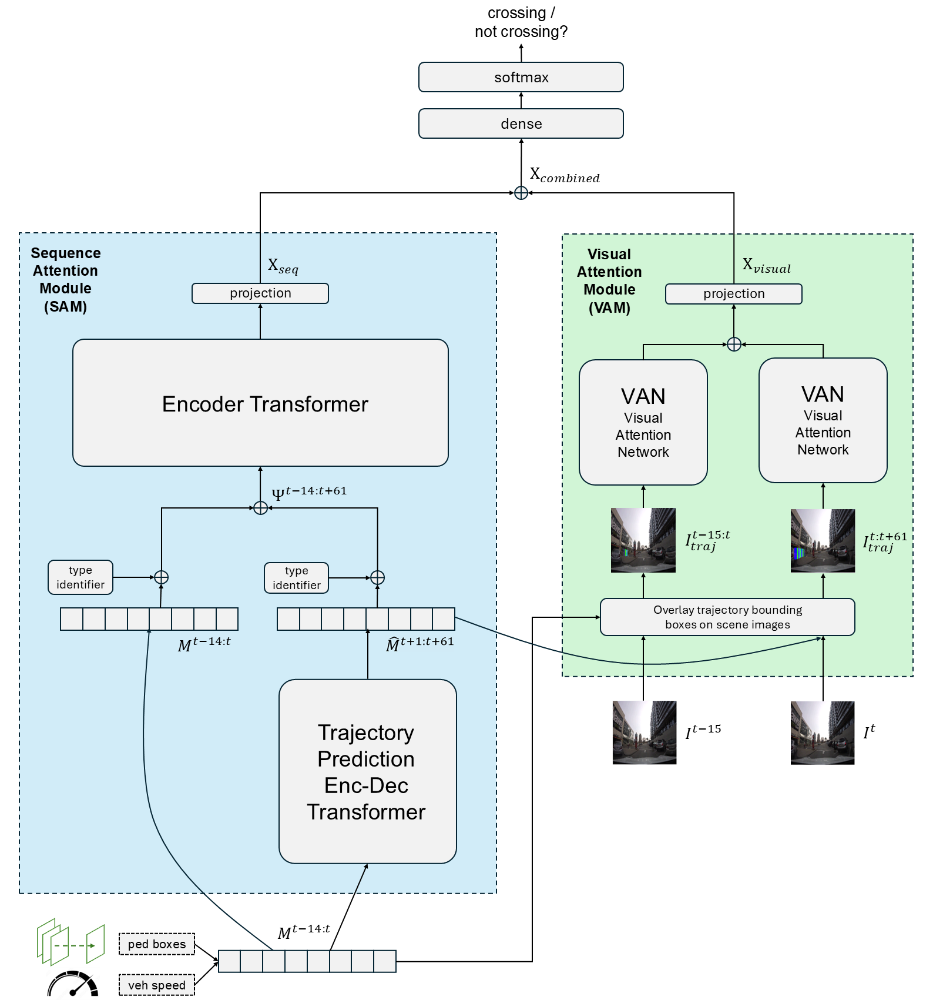

# TrajFusionNet

This repository contains the code for the paper **TrajFusionNet: Pedestrian Crossing Intention Prediction via Fusion of Sequential and Visual Trajectory Representations**

TrajFusionNet is a transformer-based model that integrates future pedestrian trajectory and vehicle speed predictions as priors for predicting crossing intention.



TrajFusionNet is composed of two branches: a Sequence Attention Module (SAM) and a Visual Attention Module (VAM). The SAM branch learns from a sequential representation of the observed and predicted pedestrian trajectory and vehicle speed. Complementarily, the VAM branch enables learning from a visual representation of the predicted pedestrian trajectory by overlaying predicted pedestrian bounding boxes onto scene images.

## Set up

Start by creating a conda environment:

```bash
conda create -n trajfusionnet-env python=3.10 pytorch torchvision pytorchvideo pytorch-cuda accelerate tensorflow -c pytorch -c nvidia -c conda-forge
```

The pytorch-cuda version might need to be specified depending on your NVIDIA driver version.

Then, install the remaining libraries with pip:

```bash
pip install -r requirements.txt
```

### Downloading the datasets

The PIE and JAAD datasets need to be downloaded and processed by following instructions provided in the following GitHub repos: [https://github.com/aras62/PIE](https://github.com/aras62/PIE) and [https://github.com/ykotseruba/JAAD](https://github.com/ykotseruba/JAAD)

After downloading the datasets, export environment variables pointing to the datasets' locations:
```bash
export JAAD_PATH=<jaad_dataset_location>
export PIE_PATH=<pie_dataset_location>
```

## Inference

To run model inference, first download the model weights from Google Drive: https://drive.google.com/drive/folders/1mXQL5W0LoYa5vZOI_SFIkFkSuyaL0ux8

Extract the zip file to the data/ directory by running:
```bash
unzip <download_location>/weights.zip -d data/
```

To perform model inference, execute the following command:
```bash
python3 train_test.py -c config_files/TrajFusionNet.yaml --test_only
```

The dataset to use and other config parameters can be modified in `config_files/TrajFusionNet.yaml`

## Training

To train the model, run:
```bash
python3 train_test.py -c config_files/TrajFusionNet.yaml --train_end_to_end
```

## Citation

If you find this repo useful, please cite the following publication:

TBD

Depending on your use of the code, please also cite the following:

* A large part of the codebase was forked from [https://github.com/ykotseruba/PedestrianActionBenchmark](https://github.com/ykotseruba/PedestrianActionBenchmark)

* The code for the transformer submodels comes from the TSLib library [https://github.com/thuml/Time-Series-Library](https://github.com/thuml/Time-Series-Library)


## Authors

* Francois-Guillaume Landry
* Moulay Akhloufi

Please email efl7126@umoncton.ca (FG Landry) or create an issue if you experience problems with running the code or setting up the environment.

## License

This project is licensed under the MIT License
